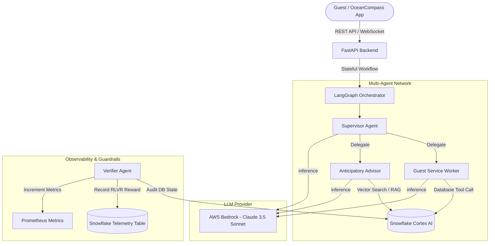

# Architecture: OceanVortex Multi-Agent System

This document outlines the architecture, coordination patterns, and data integration boundaries for the OceanVortex Agent.

## System Topology

## Tech Stack & System Components

### 1. Stateful Multi-Agent Workflow (LangGraph)
- **Supervisor Node**: Analyzes incoming messages and routes control to the appropriate worker agent based on intent.
- **Guest Service Worker**: Accesses tools to query or mutate bookings, request onboard deliveries (OceanNow), or handle payment options (MedallionPay).
- **Anticipatory Advisor**: Implements RAG (Retrieval-Augmented Generation) pipelines to scan current shipboard activities and guest preferences, outputting personalized dining or excursion recommendations.

### 2. LLM & Cloud Layer (AWS Bedrock)
- Standardizes on **Claude 3.5 Sonnet** (for heavy reasoning/Supervisor task decomposition) and **Claude 3.5 Haiku** (for fast, structured text classification).
- Connections managed using the AWS SDK (`boto3`) and securely authenticated using IAM roles on ECS tasks.

### 3. Data Warehouse & AI Analytics (Snowflake Cortex AI)
- Guest Genomics, booking profiles, real-time activity catalogs, and vector embeddings are stored in **Snowflake**.
- **Snowflake Cortex AI** functions are used to query vector tables for context-rich similarity matching during recommendations.

### 4. Reinforcement Learning from Verifiable Rewards (RLVR)
- To ensure agent operations are safe and reliable, the **Verifier Agent** audits database state after every write action.
- A numerical reward is calculated:
  - `+1.0` if the action successfully updated database state without error.
  - `-0.5` if the agent attempted an invalid state change (e.g. double booking, formatting error, or constraint violation).
- These logs are recorded in the `AGENT_EXECUTION_LOGS` table in Snowflake for fine-tuning and performance analysis.
