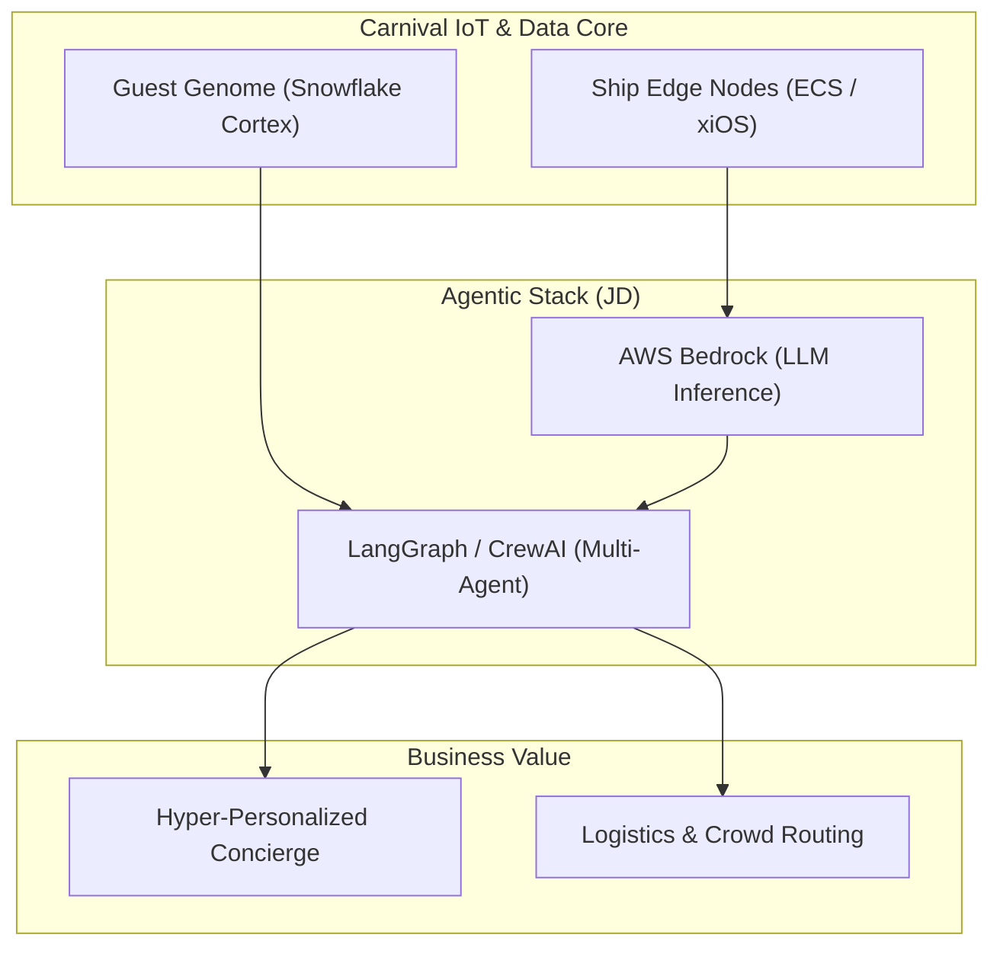

# Carnival Corporation AI/ML Stack Alignment Analysis

This document provides a strategic mapping between the tech stack specified in the **AI/ML Engineer Job Description** and the technical ecosystem and brand identity of **Carnival Corporation** (specifically their MedallionClass and smart-ship IoT framework). It also bridges this analysis with our Python-based **OceanCortex Agent** implementation.

---

## 1. Core Technology Stack from Job Description

The JD outlines a modern, production-grade agentic stack with the following focus areas:

| Layer | Technologies Specified | Purpose |
| :--- | :--- | :--- |
| **Language & Core** | Python, Standard APIs | Scientific computing, agentic scripting, data integration |
| **Agentic Frameworks** | LangChain, LangGraph, CrewAI, AutoGen | Multi-agent collaboration, stateful graphs, autonomous orchestration |
| **LLM Infrastructure** | AWS Bedrock | Enterprise-grade, secure LLM hosting & inference |
| **Data & Vector Warehouse** | Snowflake Cortex AI / Snowflake ML | SQL-friendly model execution, secure passenger data processing, RAG |
| **Cloud & Deployment** | AWS Services (SageMaker, ECS, S3, ECS Docker) | Production-ready infrastructure, scalable MLOps, storage |
| **Engineering Practices** | CI/CD, MLOps, Docker, APIs | Automated testing, monitoring, containerization, robust pipelines |

---

## 2. Carnival Corporation's Brand & Technical Identity

Carnival Corporation is the world's largest leisure travel company. From a technology perspective, they are defined by the **MedallionClass Experience**, characterized by the following paradigms:

*   **"Smart City at Sea" (xIoT):** Each cruise ship operates as an independent edge environment with thousands of interactive sensors, BLE (Bluetooth Low Energy) readers, NFC portals, and passenger portals.
*   **The Guest Genome:** A real-time, evolving digital twin of each guest's preferences, routines, dietary needs, activity choices, and historical behavior.
*   **Edge-Cloud Hybrid Model:** High latency or complete lack of internet connectivity at sea requires critical services to run locally on the ship (**xiOS**), syncing with cloud centers (AWS/Azure) when connected.
*   **Invisible Technology:** Frictionless guest interactions—doors unlock automatically, drinks are ordered via app and delivered to the passenger's exact coordinates, and personal interests shape recommendations.

---

## 3. Technology Alignment Matrix

Below is a mapping of how the JD stack directly supports Carnival's business model and identity:

| JD Technology | Carnival Strategic Use Case | Benefit |
| :--- | :--- | :--- |
| **LangGraph / CrewAI** | Multi-agent guest concierges (e.g., Shore Excursion Agent collaborating with Dining Agent & Cabin Service Agent). | Eases coordination of complex, multi-system itineraries without manual passenger intervention. |
| **Snowflake Cortex AI** | Real-time analysis of the **Guest Genome** directly inside the data warehouse where passenger information is stored securely. | Eliminates data movement latency; runs ML predictions (like next-best-action or dining preferences) in-place. |
| **AWS Bedrock** | Access to models (like Claude, Llama, Titan) with high security guardrails, running over VPC connections. | Guarantees passenger PII (Personally Identifiable Information) safety and compliance with international maritime/privacy regulations. |
| **Docker & AWS ECS** | Packaging models, agents, and microservices for deployment to shipboard servers. | Allows the exact same microservice structure to run on AWS in the cloud and on the ship's local edge compute cluster. |

---

## 4. Pure Python Agentic Architecture

Rather than a complex hybrid polyglot design (which would introduce latency, serialisation overhead, and deployment complexity to edge nodes on ships), the **OceanCortex Agent** is implemented as a 100% Python service utilizing FastAPI and LangGraph. This architecture delivers:

- **Full JD Alignment:** Direct implementation of LangGraph and Python-native interfaces.
- **Low-Latency Edge Execution:** The lightweight FastAPI backend runs within a single Docker container, ideal for shipboard computing nodes.
- **Unified Tool Calling:** Python-native tool calling integrated via LangGraph, enabling seamless communication with mock endpoints for Snowflake Cortex AI and AWS Bedrock.

---

## 5. Next Steps & Implementation Status

We have completed the core design pivot and renaming:
1. **Renamed the Project:** Unified all naming and directories under `OceanCortex Agent` / `ocean_cortex_agent`.
2. **FastAPI & LangGraph Engine:** Initialized the package structure with full tests passing.
3. **Simulated Integrations:** Built the skeleton API endpoints representing `/ocean/chat`, `/ocean/guest/profile` (Guest Genome), and `/ocean/services/order`.

