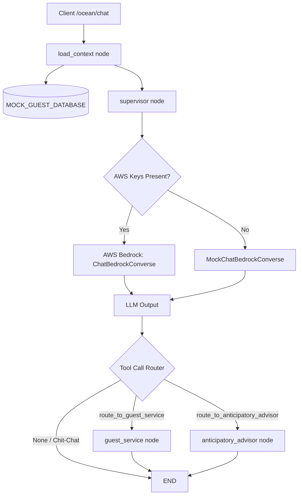

# Design: LLM-Based Supervisor Routing with AWS Bedrock & LangGraph

This design covers upgrading the `supervisor_node` in the OceanMedallion multi-agent backend to perform dynamic routing using AWS Bedrock (Claude 3.5), supported by pre-emptive guest genomics context loading and a mock fallback mode for offline/CI environments.

## Purpose
Transition the system from hardcoded keyword-based supervisor routing to an intelligent LLM-based coordinator that parses guest requests, retrieves passenger genomics context, binds routing tools, and delegates tasks to specialized worker nodes.

## Architectural Changes

### 1. State Definition (`AgentState`)
The `AgentState` TypedDict located in `ocean_agent/agent.py` will maintain:
*   `guest_id` (str)
*   `messages` (Sequence[BaseMessage])
*   `next_node` (str)
*   `context` (dict[str, Any]) — Will explicitly hold the `guest_profile` dictionary or Pydantic object.

### 2. Context Initialization Node (`load_context_node`)
A new node added to the graph before the supervisor:
1.  Lookup the guest's profile using the UUID `guest_id` from the `MOCK_GUEST_DATABASE`.
2.  If the guest doesn't exist, raise a `404 Not Found` exception immediately.
3.  Store the retrieved `GuestProfileResponse` model under `state["context"]["guest_profile"]`.

### 3. LLM Setup and Mock Fallback
Implement a wrapper function `get_chat_model()` in `ocean_agent/agent.py`:
*   **Real Client:** If AWS environment keys (`AWS_ACCESS_KEY_ID`, etc.) or credential files exist, initialize LangChain's `ChatBedrockConverse` using model `anthropic.claude-3-5-haiku-20241022-v1:0`.
*   **Mock Fallback:** If keys are missing, return a `MockChatBedrockConverse` instance that inherits from LangChain's `BaseChatModel`.
*   **Simulation Behavior:** The mock model will:
    *   Inspect incoming messages.
    *   If "mojito" or "order" is in the text, return an `AIMessage` with tool calls representing `route_to_guest_service(item_name="Mojito")`.
    *   If "snorkeling" or "excursion" is in the text, return an `AIMessage` with tool calls representing `route_to_anticipatory_advisor(excursion_name="Snorkeling")`.
    *   Otherwise, return a direct conversational greeting.

### 4. Supervisor Node Routing Tools
Define routing tools as Pydantic models/schemas bound to the LLM:
*   `route_to_guest_service(item_name: str, quantity: int = 1)`
*   `route_to_anticipatory_advisor(excursion_name: str | None = None, activity_query: str | None = None)`

### 5. Conditional Router Logic
*   Parse the last message in `state["messages"]`.
*   If a tool call is present matching `route_to_guest_service`, route to the `guest_service` node.
*   If a tool call is present matching `route_to_anticipatory_advisor`, route to the `anticipatory_advisor` node.
*   If no tool call is present, route to `END`.

## Components to Modify/Create

1.  **`ocean_agent/agent.py`**:
    *   Define `MockChatBedrockConverse` inheriting from `BaseChatModel`.
    *   Add `get_chat_model()` helper.
    *   Define routing tools.
    *   Implement `load_context_node` and register it as the graph entry point.
    *   Update `supervisor_node` to construct the context-aware prompt, bind tools, and call `get_chat_model()`.
    *   Register conditional edges based on tool name outputs.
2.  **`tests/test_main.py`**:
    *   Add unit tests verifying:
        *   Pre-emptive context loading.
        *   End-to-end routing when supervisor calls `route_to_guest_service` (assert response details and suggested actions).
        *   End-to-end routing when supervisor calls `route_to_anticipatory_advisor`.
        *   Direct responses (chit-chat fallback).

## Verification Plan

### Automated Tests
*   Run the test suite: `pyenv exec pytest tests/`
*   Verify code style: `pyenv exec ruff check .`
*   Verify type safety: `pyenv exec mypy ocean_agent/`

### Manual Verification
*   Start the stack: `docker-compose up --build`
*   Send a POST request to `/ocean/chat` with item ordering to verify routing results.
*   Send a POST request with excursion queries to verify advisor routing.
